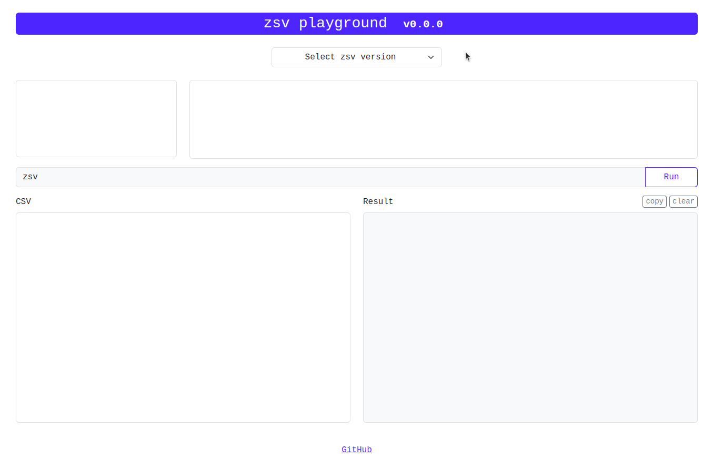

# zsv-playground

[](https://github.com/iamazeem/zsv-playground/actions/workflows/ci.yml)
[](https://github.com/iamAzeem/zsv-playground/blob/master/LICENSE)

[](https://www.buymeacoffee.com/iamazeem)

[`zsv-playground`](https://github.com/iamazeem/zsv-playground) is an x64 Linux
playground for [`zsv`](https://github.com/liquidaty/zsv) CLI executable.

Locally tested on Ubuntu 22.04 LTS with Chrome 122.0.6261.128.

> [!NOTE]
>
> This is just a small [proof of
> concept](https://en.wikipedia.org/wiki/Proof_of_concept) (PoC) and is only
> meant to explore what is possible.

## How it works

- On startup, `zsv-playground` downloads and extracts the latest three `zsv`
  [releases](https://github.com/liquidaty/zsv/releases) to `zsv` subdirectory on
  the current path.
- These downloaded `zsv` executables are used to serve the generated webpage in
  the browser.
- The user inputs the `CSV`, selects a command, chooses the required flags, and
  hits `Run`.
- The output is then shown under `Result`.

### Demo



## Limitations

- Only global flags and main commands are supported now.
- Some commands require multiple files or non-flag CLI arguments as input.
  - This is currently not supported but may be added later.

## Download

Download the latest build from the
[releases](https://github.com/iamazeem/zsv-playground/releases) page.

## Run

```shell
./zsv-playground
```

Go to http://localhost:8080/ in your browser.

Run `zsv-playground --help` to check the available CLI options.

## Development

### Tech stack

- [Go 1.21.4](https://go.dev/doc/install)
- [Bootstrap v5.3.3](https://getbootstrap.com/)
- [HTMX 1.9.10](https://htmx.org/)

### Build

```shell
git clone https://github.com/iamazeem/zsv-playground.git
cd zsv-playground
go build
```

## Contribute

Feedback is always welcome!

[Open an issue](https://github.com/iamazeem/zsv-playground/issues/new/choose) to
report bugs or propose new features and enhancements.

- [Fork](https://github.com/iamazeem/zsv-playground/fork) the project.
- Check out the latest `main` branch.
- Create a `feature` or `bugfix` branch.
- Commit and push your changes.
- Submit the PR.

## License

[MIT](./LICENSE)
